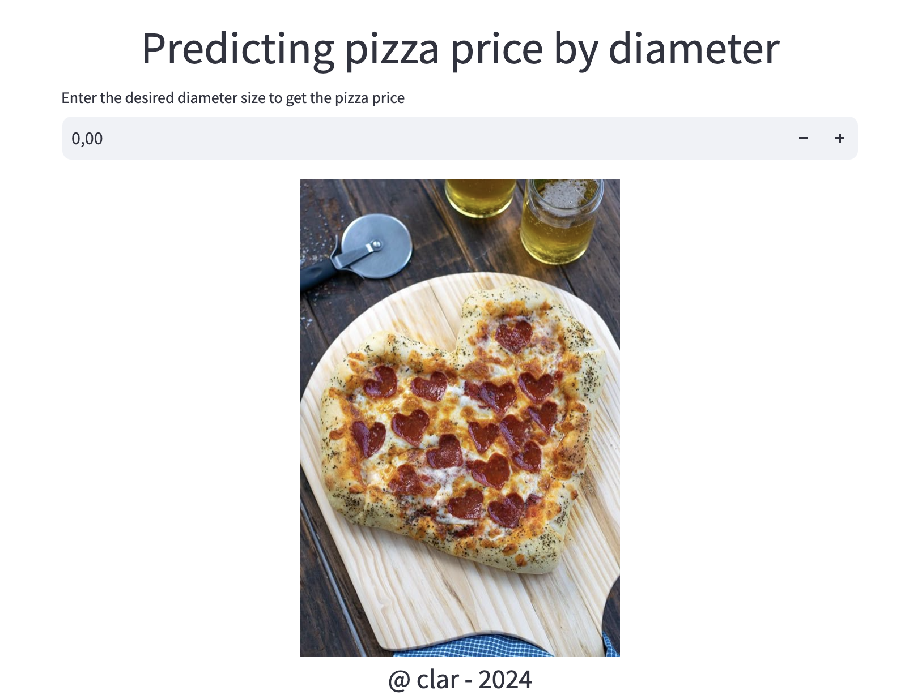
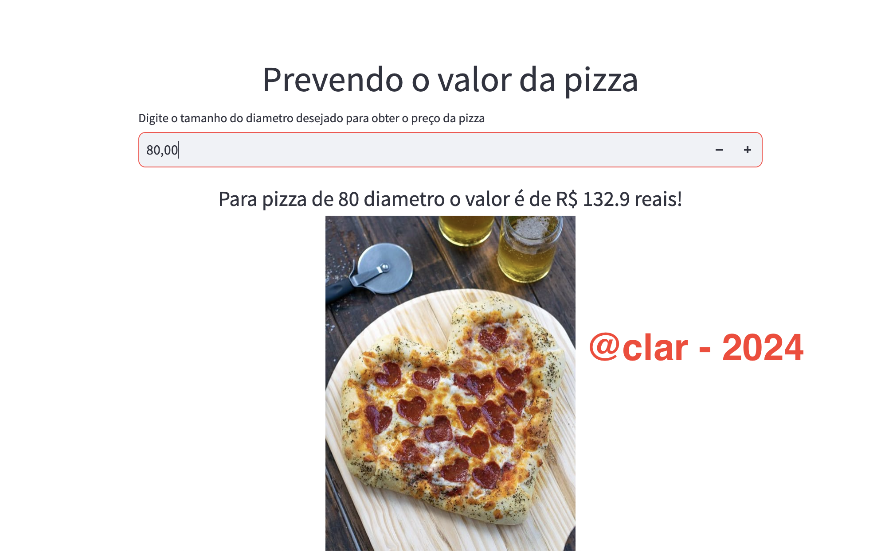

## (ENG) Artificial Intelligence Project

The project uses the scikit-learn lib to train a data set containing diameter and pizza value. After training the data, it is possible to predict the pizza value from the diameter. Linear regression was used for training.
Streamlit was used for the front end, making it possible to interact directly with the model, passing the diameter and receiving the expected result.
To convert real into dolar this project uses API https://economia.awesomeapi.com.br/json/daily/USD-BRL/1 for last variation getting current dolar value.

### Front/Streamlit



## (PT) Projeto de Inteligencia Artificial

O projeto usa a lib scikit-learn para treinar um conjunto de dados contendo diametro e valor de pizza, após o treino dos dados é possivel prever o valor da pizza a partir do diametro. Foi usada regressão linear para o treino do modelo.
Para o front foi utilizado o streamlit, sendo possivel interagir direto com o modelo, passando o diametro e recebendo o resultado esperado.

### Front/Streamlit



## Deploy pt

```python
poetry env use python3.11
poetry add requirements.txt
poetry shell
streamlit run app_pt.py
```

## Deploy eng

```python
poetry env use python3.11
poetry add requirements.txt
poetry shell
streamlit run app.py
```
